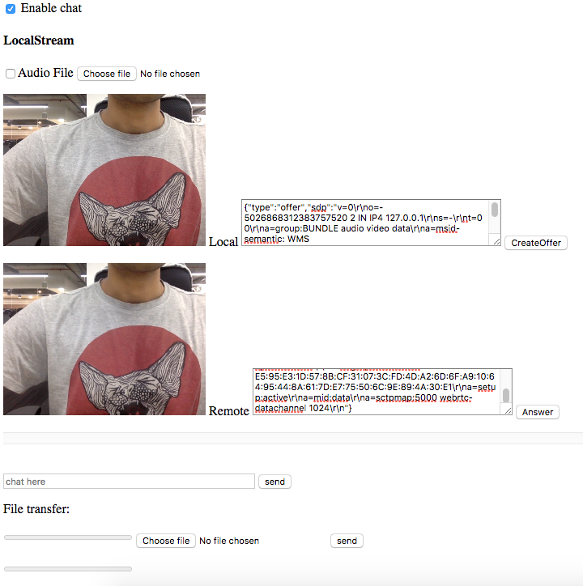

### serverless-webrtc
---
* Is it possible to create a p2p connection without a signalling server? 
Yes!
* How?? copy paste the SDPs between local and remote that's it!
* Are you kidding?? Nope, Please open `index.html` in a localhost and go through the steps. 
* This Serverless webRTC concept is only for learning javascript webRTC APIs

### setup
on macOS/Linux just clone this repo and start a http server

`
cd serverless-webrtc

python -m SimpleHTTPServer 8080

if you have node http-server

http-server -p 8080 .

http://localhost:8080/index.html
`
### Onine demo
https://svarunan.github.io/serverless-webrtc/

### Usage
* open this url in two tabs lets say A and B.
* click on createOffer in A, copy paste the sdp in B's Remote text box, click "answer" button and this will add sdp to local text box.
* Of B's local text box, copy paste sdp text in to A's Remote text box and click on "answer" button, then you should be able to see p2p connection working

### features
* peer to peer video calling
* chat
* file transfer

### Snap

### Contribute
Let's share the Joy together. Let's keep this project super simple. Raise PR if you see something deprecated or not working.
